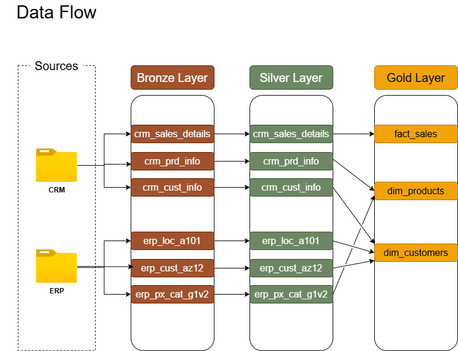

# 🏢 Data Warehouse Medallion Architecture: End-to-End SQL Pipeline

## 🌟 Project Overview
This project demonstrates the design and implementation of a modern **Data Warehouse** using the **Medallion Architecture** (Bronze, Silver, Gold). The goal was to build a robust ETL (Extract, Transform, Load) pipeline that integrates disparate data from **CRM** and **ERP** systems into a centralized, reporting-ready Star Schema.

By moving data through three distinct layers, the architecture ensures data lineage, high quality, and a "Single Version of Truth" for business stakeholders.

---

## 🏗️ Architecture Design
The warehouse is built on the **Medallion Architecture** principle:

* **Bronze Layer (Raw):** Landing zone for raw data as-is from source systems.
* **Silver Layer (Cleansed):** Data is standardized, deduplicated, and cleansed of "dirty" values.
* **Gold Layer (Curated):** Business-level views organized in a Star Schema (Dimensions & Facts) optimized for analytics.



---

## 🛠️ Technology Stack
* **Database:** SQL Server (T-SQL)
* **Modeling:** Star Schema (Dimensional Modeling)
* **Tools:** Git, Draw.io (Documentation), Notion (Project Planning), Google Gemini (Documentation)
* **Environment:** Medallion Architecture (Bronze, Silver, Gold)

## 📁 Repository Structure
```text
├── datasets/             # Raw CSV data (CRM & ERP)
├── docs/                 # Architecture, Data Model, & Diagrams (PNG/Draw.io)
│   ├── data_catalog.md   # Data dictionary & column descriptions
│   └── naming_conventions.md # Project governance & naming rules
├── scripts/              # SQL scripts for DDL and Stored Procedures
│   ├── bronze/           # Extraction logic
│   ├── silver/           # Transformation & Cleaning logic
│   ├── gold/             # Reporting Views (Star Schema)
│   └── init_database.sql # Database initialization
├── tests/                # Data Quality & Validation scripts
└── README.md             # Project documentation
```
---

## 🚀 The ETL Process

### 1. Bronze: Extraction (The "E" in ETL)
Data is ingested from external CSV files using high-performance `BULK INSERT` commands. No transformations are performed here to maintain an audit trail of the original raw data.
* **Script:** `scripts/bronze/proc_load_bronze.sql` - [click here](scripts/bronze)

### 2. Silver: Transformation (The "T" in ETL)
This layer performs heavy lifting, including:
* **Deduplication:** Using `ROW_NUMBER()` to ensure unique customer records.
* **Data Standardization:** Mapping inconsistent values (e.g., 'M' -> 'Male', 'DE' -> 'Germany').
* **Data Type Conversion:** Converting `INT` date formats to `DATE` objects.
* **Audit Columns:** Adding `dwh_create_date` for traceability.
* **Script:** `scripts/silver/proc_load_silver.sql` - [click here](scripts/silver)

### 3. Gold: Loading (The "L" in ETL)
Final reporting views are created using a **Dimensional Model**. This layer links CRM and ERP data into a seamless experience for BI tools.
* **Dim_Customers:** Merged view of CRM & ERP customer data.
* **Dim_Products:** Filtered to show only current, non-historical products.
* **Fact_Sales:** Central transaction table linking to dimensions via surrogate keys.
* **Script:** `scripts/gold/ddl_gold.sql` - [click here](scripts/gold)


---

## ✅ Data Quality & Governance
A critical component of this project is the **Data Quality Framework** found in the `/tests` folder.

* **Discovery Checks:** Identifying nulls, duplicates, and malformed data in the Bronze layer.
* **Verification Checks:** Confirming that all cleaning logic was successfully applied in the Silver layer.
* **Referential Integrity:** Ensuring every sale in the Fact table has a valid corresponding Customer and Product key (No "orphan" records).

**Project Standards:**
* Strict adherence to `snake_case` naming conventions.
* Use of **Stored Procedures** for modular and reusable ETL code.
* Full **Data Catalog** documentation for business users.

---

## 📅 Roadmap: Future Phases
While this project covers the **Data Engineering** foundation, the warehouse will be utilized in upcoming projects:
1.  **Phase 2: Exploratory Data Analysis (EDA):** Discovering trends and patterns within the Gold layer.
2.  **Phase 3: Advanced Analytics:** Building predictive models using the curated data.
